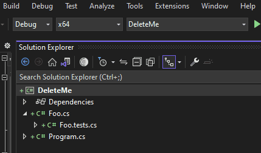

# Flex Test
FlexTest is a lightweight unit testing framework for .NET designed with the following objectives beyond what existing frameworks provide:

1. Provide native access to private methods from within tests
2. Keep code and tests in the same relative location
3. Create controlled environments for tests with the use of test fixtures which fully leverate OOAD
4. Improve performance with paths to failure that are not exclusively throwing exceptions
5. Support programmatic test creation for dynamic data-driven tests


# Quick Start

## Modify .csproj File
Add the following element to your CSProj file under the root `PropertyGroup` element
```xml
  <ItemGroup>
    <Compile Remove="**\*.tests.cs" Condition="'$(Configuration)' == 'Release'" />
    <Compile Update="**\*.tests.cs">
      <DependentUpon>$([System.String]::Copy(%(Filename)).Replace(".tests",".cs"))</DependentUpon>
    </Compile>
    <None Update="**\*.md">
      <DependentUpon>$([System.String]::Copy(%(Filename)).Replace(".md",""))</DependentUpon>
    </None>
  </ItemGroup>
```

## Add a Fixture to your class
```csharp
//Foo.tests.cs
partial class Foo
{
  public class TestFixture : FlexTest.TestFixture
  {
  }
}
```

## Test Explorer Integration
1. Add a new MSTest Project to your solution (named e.g. "Test Explorer Test Harness")
2. Add a reference to `Spin.FlexTest.TestAdapter`
3. Add a reference to any libraries you want to test
4. Add a new `TestHarness.cs` class with the code below
5. Name all of the assemblies you want to load in the `Tests.Load` call

```csharp
using Spin.FlexTest;
namespace Test_Explorer_Test_Harness;

public class TestHarness : Spin.FlexTest.FlexTestHarness
{
  public override IEnumerable<Test> DiscoverTests() => Tests.Load("AssemblyToLoad");
}
```


# Walkthrough

## Static Test
Create a simple test within a class
```csharp
class Foo
{
  private int Bar() => 5;

  [Test]
  public static void TestBar() 
  {
    var foo = new Foo();
    if(foo.Bar() != 5)
      throw new Exception();
  }
}
```

## Test Fixtures
Test fixtures provide the test methods with contextual members specific to testing (such as Assert)
```csharp
class Foo
{
  private int Bar() => 5;

  public class TestFixture : FlexTest.TestFixture
  {
    [Test]
    public void TestBar() 
    {
      var foo = new Foo();
      Assert(foo.Bar() != 5);
    }
  }
}
```

## Fail fast
Exceptions are expensive - fail your tests and provide feedback without throwing exceptions
```csharp
class Foo
{
  private int Bar() => 5;

  public class TestFixture : FlexTest.TestFixture
  {
    [Test]
    public void TestBar() 
    {
      var foo = new Foo();
      if(foo.Bar() != 5)
        Fail("I can't math");
    }
  }
}
```

## Partial Classes
Partial classes help to keep your tests organized while maintaining separation of concerns 
```csharp
//Foo.cs
partial class Foo
{
  private int Bar() => 5;
}

//Foo.tests.cs
partial class Foo
{
  public class TestFixture : FlexTest.TestFixture
  {
    [Test]
    public void TestBar() 
    {
      var foo = new Foo();
      Assert(foo.Bar() != 5);
    }
  }
}
```

## Automatically exclude tests from release builds
MSBuild directives keep code and tests together while excluding tests from release builds




## Object-Oriented Behavior Modification
Use intellisense to alter the context of your tests instead of decorating with attributes
```csharp
partial class Foo
{
  public class TestFixture : FlexTest.TestFixture
  {
    private IDbConnection _conn;
    override void Initialize()
    {
      _conn = new SqlConnection();
      _conn.Connect();
    }

    override void Dispose()
    {
      _conn.Close();
      _conn.Dispose();
    }

    [Test]
    public void TestBar() 
    {
      using(var cmd = _conn.CreateCommand())
        ...
    }
  }
}
```

